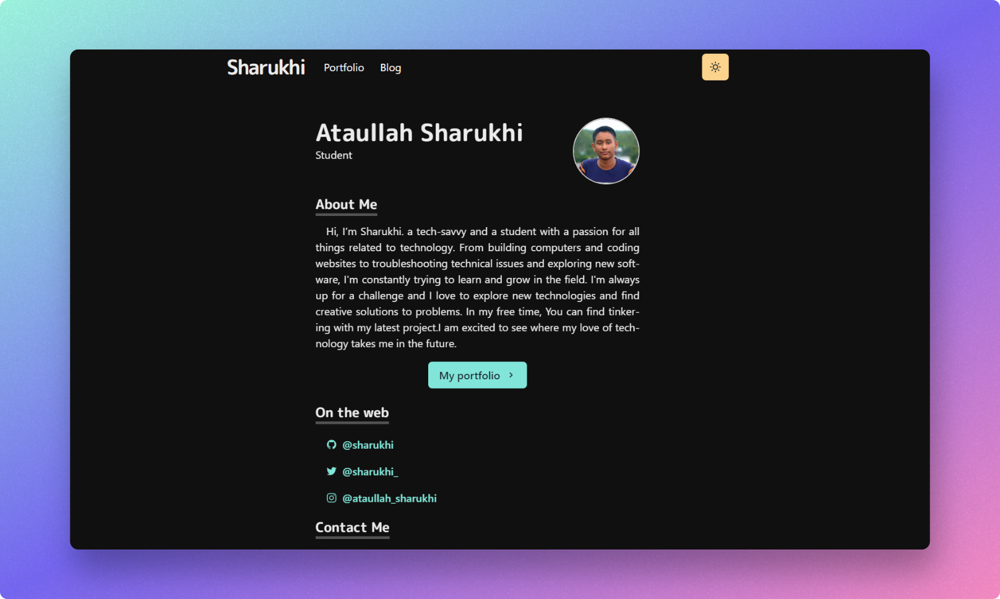

# Sharukhi's Portfolio

[sharukhi.me](https://sharukhi.me/)




## Stack

- [Next.js](https://nextjs.org/) - A React framework with hybrid static & server rendering, and route pre-fetching, etc.
- [Chakra UI](https://chakra-ui.com/) - A simple, modular and accessible component library for React
- [Three.js](https://threejs.org/) - 3D library for JavaScript
- [Framer Motion](https://www.framer.com/motion/) - An animation library for React

## Project structure

```
$PROJECT_ROOT
│   # Page files
├── pages
│   # React component files
├── components
│   # Non-react modules
├── lib
│   # Static files for images and 3d model file
└── public
```

## License

MIT License.

 ***This website is based on [Takuya Matsuyama's homepage](https://github.com/craftzdog/craftzdog-homepage)***


---
You can create your own website for free under the following condition:
 - Attribution: You must give appropriate credit, provide a link to Takuya Matsuyama's homepage (https://www.craftz.dog/).
 - For example: 
 ```bash
 This website is built based on the <a href='https://www.craftz.dog/' target='_blank'>Takuya Matsuyama's website</a>
 ```
---

